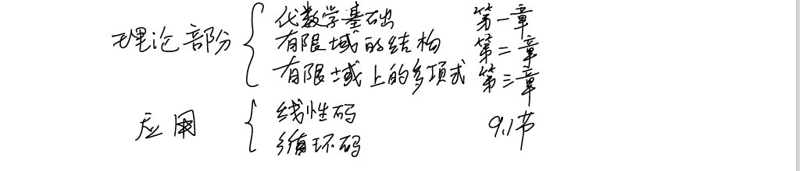
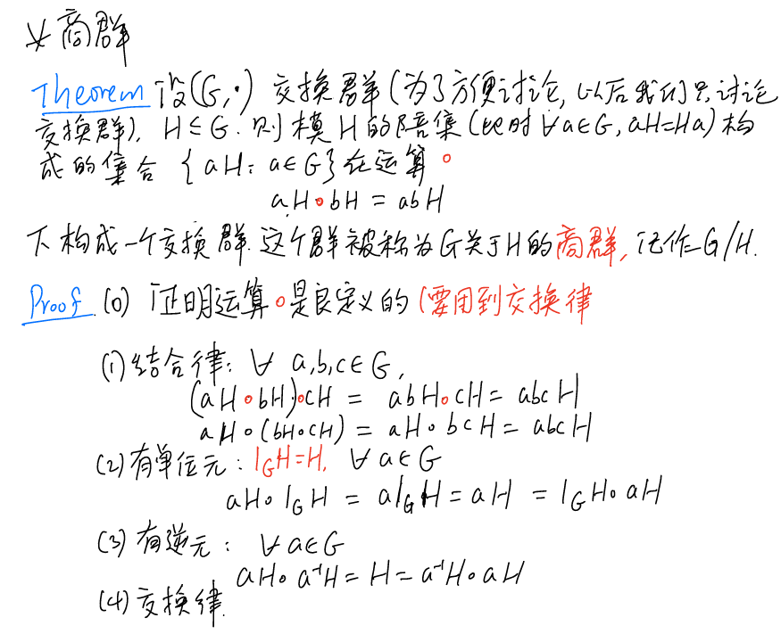
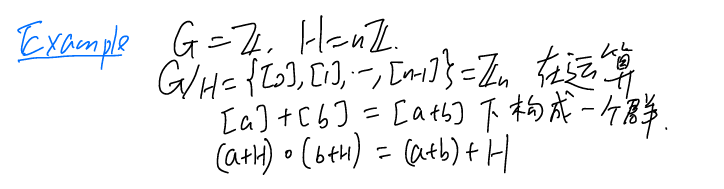
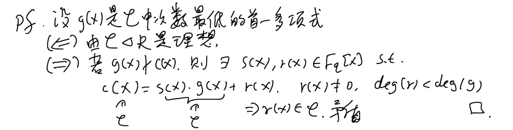

# 上官老师的有限域笔记

## Lecture 1

有限域关键的性质：

本课程内容：

### 群的定义：

**即群<u>满足结合律</u>，<u>有单位元</u>，<u>有逆元</u>的集合。**~~不一定交换~~

第一条的证明：$e1=e1*e2=e2$

第二条的证明：如果b,c是a的逆元，$c=e*c=(b*a)*c=b*(a*c)=b*e=b$

第三条的证明：利用结合律易得

我们约定了群中关于幂的定义：

·

### **群的阶**&&**元素的阶**：

特别的，无限群可能有<u>有限阶元素</u>（除单位元），

但有限群一定不含<u>无限阶元素</u>。

## Lecture 2

### 定理1.1.1：元素的阶：

### 定理1.1.2：$o(a^k)=\frac{m}{gcd(k,m)}$

### 定理1.1.3 $o(ab)=o(a)o(b)$

群$G$有，对任意的 $a,b\in G$ , $o(a)=n$ ,$o(b)=m$ ,$gcd(m,n)=1$ 且 $ab=ba$ ,则$o(ab)=o(a)o(b)=mn$

证明： 设$o(ab)=r$,即$(ab)^r=e$

首先，$(ab)^{mn}=a^{mn}b^{mn}=(a^m)^n(b^n)^m=e$

> 举个例子帮助理解：$(ab)^2=a(ba)b=a(ab)b=a^2b^2$ 

所以 $r|(mn)$ 且 $r\leq mn$

又因为 $e=(ab)^{rm}=a^{mr}b^{mr}=a^{mr}$ 所以 $n|mr$ ,因为 $gcd(n,m)=1$ ,所以 $n|r$

同理可得，$m|r$,而 $gcd(n,m)=1$ ,所以 $mn|r$ ,即 $mn\leq r$

所以，$o(ab)=r=mn$

### 【※】定理1.1.4 任意a∈G，o(a)|交换群G中元素的最大阶n

矛盾点在于如果不整除，可以找到了比$g$更大阶的元素$g^`f^`$

**一个推论，有限的交换<u>单群</u>当且仅当是素数阶循环群。**且素数阶群必为循环群

对于前半部分，单群就是没有非平凡正规子群(左右陪集相等)的群，而交换群的子群都是正规子群，这是结论成立的关键，显然一个循环子群是它所在群的正规子群，设G是单群且阶为n，在G 中任取元素 a 不等于e,若 a 的阶小于 n, 则由于G是交换群，故e∈$\langle a\rangle\triangleleft G$，a生成的循环群是个正规子群，这与G是单群矛盾。故a的阶=n，从而 G={(a)}, 故G为循环群。若n不是素数，则必定存在$\left\langle a^k\right\rangle$,(k,n)$\dot{\neq}$1为G 的非平凡正规子群（元素的阶整除群的阶），与G 为单群矛盾，所以 n 必然为素数。

对于后半部分，取群中一个非单位元，考虑能表示成它整数幂次的元素，那这个集合不难看出，恰好是由它生成的循环群，并且是原来群的一个子群。lagrange定理告诉我们**子群的阶数一定整除原来的群的阶数**，但是原来的群的阶数是素数，因此这个子群的阶数只能是1或p，如果是1，注意到单位元和我们选择的非零元都在此子群里，这是不可能的；因此子群的阶数为p，即该子群就是群G，G为循环群。

### 等价关系

等价具有自反，对称，传递性质，等价类要么相等要么交集为空

定义**同余**这种等价关系

下面给出一个比较重要的同余类群$Z_n$：模n的剩余类群，群元素是集合（同余类）

## Lecture 3

### 子群的定义：

设G 是群，H≤G，则子群H 的单位元就是群G的单位元，H中元素在H中的逆元就是在G中的逆元。

这个定理的证明是显然的，只需在下面等式应用群中的消去律即可。

$$
e_{H}e_{H}=e_{H}=e_{H}e_{G}(和证明群单位元只有一个是一样的);\\a_{H}^{-1}a=a_{G}^{-1}a.
$$

------

**去年期中原题**：证明：乘法群 G 的任一非空子集 H 是 G 的子群，当且仅当对$\forall a$,$b\in H$,都有$ab^{-1}\in H$。如果 H 是有限的，那么条件可替换为对任意$\forall a,b\in H$都有$ab\in H$。

 必要性显然，a,b 属于群 H 则$ab^{-1}\in H$
 充分性：H 非空，故 H 至少包含元素 a,由于条件$\forall a$, $b\in H$,都有$ab^{-1}\in H$。故 $a*a^{-1}=e $也属于 H,
 那么$\forall a,b\in H$,他们俩的逆也属于 H,则 a(b^-1^)^-1=ab 属于 H，乘法封闭，再加上有单位元有逆
 元，故H是群，有H是G子集，故H是子群。

有限时，必要性显然，充分性：$ab$ 属于 $H$ 乘法封闭，$a^2$ 属于 H, 进而$ a^n $属于 H, 又 H 有限，$a^n = a^t<a^n$，b 属于 H, 故$a^{n-t}$=$e \in H$，故 H 是子群。

------

### 定理1.1.6 把a=bh设为等价关系

接着给出陪集的概念，陪集aH是{ah:h∈H}的集合。

可以理解成在同余类中，a是那个余数，b=h+a，h∈H

这就是下面提到的**拉格朗日定理的证明**，利用相同大小的子群可以由一个子群做陪集得到。

### 定理1.1.8 拉格朗日定理(子群的阶整除群的阶)

给出两个示例：

第一个例子，nZ是群Z的子集，nZ≤Z

由于nZ是一个子集，故a+nZ是左陪集，Z是整数群，则a+nh就是符合带余除法的表示，a+nZ是模a的剩余类【a】.

第二个例子，则是关注一个群$Z_6$,即模6的剩余类群，其中有6个元素，分别是模6余0-5的剩余类。

**拉格朗日定理的重要推论：群元素的阶整除群的阶**

证明：我们知道一个元素的阶定义等价于这个元素生成的循环群的阶数，因为这个元素在群 G 中，所以生成的群 K 是 G 的子群，利用 Langrage's Theorem ，原命题得证。

### 商群

商群是陪集的集合，群中的元素是集合。G关于H的商群记作G/H={gh:g属于G}

下面是一个商群的例子：

即$Z_n$是同余类组成的群。

### 【※】循环群

这个一般性问题该如何证明？

由于$Z_n=Z/nZ$={[0],[1],[2],...,[n-1]}=<[1]>，由于$Z_n$的运算定义为模n的加法运算。

------

特别的，**循环群的子群都是循环群：**

对于G的非平凡子群H，|H|>=2，H包含单位元e以及至少一个a的某个正次幂（a是G的生成元），那么我们假设d=min{n∈$Z_+$:$a^n$∈H}，d一定存在，显然d是H中a的最小正次幂。

下面证明H=<$a^d$>：对于每个h=$a^s$∈H，s=qd+r,则$a^s=a^{qd+r}=(a^d)^qa^r∈H$，因为$a^{-d}∈H$，故$a^{-qd}∈H$,故$a^r=a^sa^{-qd}∈H$，但r<d，故r=0，故**d|s**。

------

## Lecture 4

### 循环群的性质

证明：

1. **存在性**：根据定理1.1.2，$o(a^k)=\frac{m}{gcd(k,m)}$，则$o(a^{d})=\frac{m}{gcd(d,m)}=\frac{m}{d}$,由拉格朗日定理其生成的循环群指数为d.

    **唯一性**：假设 $d$ 已给定，则根据定理 $1.1.2,\langle a^d\rangle$ 是阶为 $\frac md$ 的子群，因此指数为d。 假设$\langle a^k\rangle$ 是另一个指数为 $d$ 的子群，则根据$1.1.8（拉格朗日定理-子群大小）,|\langle a^k\rangle|=\frac md.$ 但另一方面，
    $|\langle a^k\rangle|=\frac m{(m,k)}$.所以 $d=(m,k)$,因此有 $d\mid k,a^k\in\langle a^d\rangle,\langle a^k\rangle\subset\langle a^d\rangle$.但由于 $\langle a^k\rangle$ 和 $\langle a^d\rangle$ 有相同的阶. 所以 $\langle a^k\rangle=\langle a^d\rangle.$

2. 设$a^k$ 是$G$ 中的一个元素.则 $a^k$ 的阶是 $\frac m{(k,m)}.$ 所以 $a^k$ 的阶是 $f\Leftrightarrow m=f\cdot$ $(k,m)\Leftrightarrow(k,m)=\frac mf$.令$k=h\cdot\frac mf$,则$(k,m)=\frac mf\Leftrightarrow(h,f)=1$.而$h$ 的个数正好是$\phi(f).$【思路就是有几个k，写出k的表达式来看数量】

3. 因为 $G$ 的生成元一定是阶为 $m$ 的元素，根据 2),所以 $G$ 的生成元的个数为 $\phi(m).$ 设$a^r\in G$ 是$G$ 的一个生成元，则 $o(a^r)=m\Leftrightarrow\frac m{(r,m)}=m\Leftrightarrow(r,m)=1.$

### 群和群的关系

同态就是保持运算。ker就是单位元的像。

**练习**【今年期中考试考了】：

(1)a∈G，$1_H=f(a)-f(a)=f(a-a)=f(1_G)$

(2)有单位元，有逆元(由下面性质3，对任意的 $\mathrm{h\in Kerf}$,则有 $\mathrm{f( h^{- 1}) = ( f( h) ) ^{- 1}= ( e^{\prime}) ^{- 1}= e^{\prime}, }$ 于是 h$^{- 1}\in $Kerf)，加法封闭（有同态），所以是子群

(3)$f(a^{-1})f(a)=f(a^{-1}a)=f(1_H)=f(a)^{-1}f(a)$.

(4)必要性显然。充分性：$\text{若}\operatorname{Kerf}=\{\mathrm{1_G}\},\text{设}\mathrm{f}\text{ 不是单射,}$则存在 $\mathrm{x_1, x_2\in G, s.t.x_1\neq x_2, f( x_1) = f( x_2) }$
则$\mathrm{f( x_1- x_2) = f( x_1) - f( x_2) = 1_H}$ ，从而$\mathrm{x_1- x_2\neq 1_G}$且$\mathrm{x_1- x_2\in Kerf}$，矛盾。

### 定理1.1.15 同态基本定理

需要补充的是该定理要求**交换群**。

## Lecture 5

### 环和理想

在一个交换群的基础上，乘法封闭，乘法结合，加法和乘法满足分配律。

**下面给出各类环的定义：**

（环）集合R对+满足结合律，分配律和交换律，对*+满足结合率

（有单位元的环）如果环中有乘法单位元

（交换环）乘法交换

（整环）有乘法单位元，无零因子的交换环

（除环）有乘法单位元，有乘法逆元的环（乘法构成一个群），不保证交换

（域）每个非零元都有乘法逆元的交换环

（主理想）R是交换环，J是理想，如果存在a,使得J=(a),则J为主理想

（主理想整环）R是整环，所有J都是主理想，称R为PID

可以证明，有限整环都是域。

即证明有限整环存在乘法逆元，由有限性，必有，$x^m=x^n=x^m*x^{n-m}$,故

$$0=x^m*x^{n-m}-x^m=x^m(x^{n-m}-1)$$

由于无零因子，且$x^m$不为0，故$x^{n-m}=1$，即$x^{-1}=x^{n-m-1}.$

**定义-子环与理想**

理想具有吸收特性，和理想中的元素做运算会被吸收进理想。

平凡理想就是{0}和R。

**★子环的判定定理：**环 $R$ 的子集 $S$ 为子环的充分必要条件是 $a,b\in S$ ,则 $a-b\in S,ab\in S$ 。

**证明：**$ab\in S$ 保证了乘法封闭性，无需多言。

$a-b\in S$ 保证了S为加法子群 (注：$a+b\in S$ 是不能够保证的),证明如下：

$a-a=0$ , 说明0元—定在S中。若$a=0$,则$a-b=0-b=-b\in S$,所以b的逆元也在S中，这就证明了元素的逆元也在S中。$-b\in S$ ,则 $a-(-b)=a+b\in S$ ,这就证明了加法的封闭性。

因此：$a\in S,b\in S,a-b\in S$ 能够保证加法群的封闭性，单位元和逆元。所以结论成立。

------

**练习：R是交换环，a∈R，那么证明**

(1){ra+na:r∈R,n∈Z}$\triangleleft$R

(2)上述理想是包含a的最小理想，称为a生成的理想(a)

(3)如果R有单位元，则(a)={ra}，即na=ne*a，ne也是r，故可以省略

**解：**(1)可以用定义证明，(3)已经证明，下面考虑(2)

我们要证明(a)是包含a的最小理想:

1. 首先，显然a=1*a+0*a∈{ra+na: r∈R, n∈Z}，所以(a)包含a。
2. 然后，**对于任何包含a的理想I，要证明{ra+na: r∈R, n∈Z}都包含在I中**。因为a∈I，所以对于任意的r∈R，n∈Z，我们有ra+na=a*r+n*a∈I。因此{ra+na: r∈R, n∈Z}⊆I。

综上所述，我们证明了{ra+na: r∈R, n∈Z}是包含a的最小理想，也就是a生成的理想(a)。

**定义-主理想**

可以证明，**整数环(Z,+,*)是个PID,任何理想I都是(a),a是I中的最小数**。

**证明**：设$b\in I.$ 

若$b=0$,则$b=0\cdot a$，若 $b\neq0$ ,有带余除法 $b=qa+r,0\leq r<a$ ,则 $r=b-qa\in I$ ,但是 $r<a$ 这与 $a$的选取矛盾.

因此$r=0\Rightarrow b=qa\Rightarrow I=<a>\Rightarrow\mathbb{Z}$ 是主理想整环

**定义-商环/剩余类环**

注意，这里老师笔误，R/J是商环，**商环就是剩余类环**，类似于商群的概念。

### 环同态基本定理

类似于群同态，但是加法和乘法都要满足同态。

### 环的特征

任意r属于R，nr=r+r+r+…+r=0（加法单位元）,且没有更小的n，char(R)=n,若n不存在，char(R)=0。

### 定理1.2.10 有限整环（有限域）的特征一定是素数

需证明ch(R)>0,chr(R)=prime

R首先是一个加群，那么任意a∈R，o(a)整除R的阶，故至少|R|a=0，所以这个ch(R)是存在的。

下面证明其为素数，设该值为n=pq，R的乘法单位元e，有ne=0，即(pq)e=0

(pq)e=pq个e相加=q个（p个e相加）相加=（p个e相加）×（q个e相加）=pe×qe=0

则pe=0或qe=0，与特征定义矛盾。

### 定理1.2.11 设R为特征p的交换环，有$(a+b)^{p^n}=a^{p^n}+b^{p^n}$

这个题期中考了，利用了pa=0,下面考虑一个简化版

证：因为 $p$ 是素数，则有 $C_p^k$ 是 $p$ 的倍数 (如果相信组合数都是整数，这个结论不难得到),又
 $(a+b)^p=a^p+b^p+\sum_{k=1}^{p-1}C_p^ka^kb^{p-k}$,就有$C_p^ka^kb^{p-k}=n(pa^k)b^{p-k}$ $=n0b^{p-k}=0$ ,因此就有 $(a+b)^p=a^p+b^p$ ;若 $p$ 是奇数，则 $-b^p=(-b)^p$ ,代入前面的证明结论即可，若$p=2$,$b=-b$,$a-b=a+b$,结论显然成立。

### 多项式环

R[x]是所有以x为未定元，系数在R中的多项式f(x)的集合。

**[形式多项式]**系数在环 $R$ 中的多项式，是变量的幂的 (有限) 线性组合：
$$
f(x)=a_nx^n+a_{n-1}x^{n-1}+\ldots+a_1x+a_0.a_i\in R.
$$
 这种表达称为形式多项式。
 **[多项式的集合]** 系数在环 $R$ 中的多项式的集合记为 $R[x].$

-  例如 $Z[x]$ 是整系数多项式的集合——整数多项式集。

 **[单项式]** $x^i$
 **[多项式相等]** 多项式 $f(x),g(x)$ 相等，的当且仅当 $a_i=b_i,\forall i=0,1,2...$
 **[多项式的次数]**一个非零多项式的次数记作 $degf$ ,它是使得 $x_n$ 的系数不为零的最大整数 $n$ 。

-  零次多项式称为常数多项式。
-  零多项式也是常数多项式，但它的次数没有定义。

 **[首项系数]** 最高次的非零系数称为多项式的首项系数。

**首一多项式**：首项系数为 1 。

R[x]是一个环，其中运算指环 $R$ 中的加法和乘法：
$$
f(x)+g(x)=\sum_k(a_k+b_k)x^k\\f(x)g(x)=\sum_{i,j}a_ib_jx^{i+j}.
$$

------

## Lecture 6

### 域上的多项式环F[x]

即多项式也有**整除**关系，也可以使用**带余除法(习题部分第一题)**如下：

### 定理1.3.3 域F的多项式环[x]是主理想整环

证明方法和**整数环是PID**一样，使用反证法如下，任取 $F[x]$ 的一个理想 $I$ , $I\unlhd F[x]$。如果 $I=\{0\}$ 为平凡理想，则 $I$ 由 0 生成，自然是主理想。

如果$I\neq\{0\}$,在$I$ 中取一个次数最低的非零多项式 $g(x)$ 。$\forall f(x)\in I$ ,对 $f(x)$ 和 $g(x)$ 作带余除法，有 $f(x)=g(x)q(x)+r(x)$ , $deg(r(x))<deg(g(x))$ 。

根据理想(ideal) 的定义，$r(x)\in I$。由$g(x)$ 次数最低可知 $r(x)=0$ 。那么，$f(x)=g(x)q(x)$ 。根据 $f(x)$ 的任意性，理想 $I$ 可由 $g(x)$ 生成，因此理想 $I$ 是一个主理想。

那么 $F[x]$ 的任一理想都是主理想，也就证明了 $F[x]$ 为主理想整环。

唯一分解整环即UFD，PID一定是UFD，证明是唯一分解整环，等价于证明该环的不可约元是素元。 若 $r$ 是不可约元，则 $\langle r\rangle$ 是极大理想 (不可约元生成的理想在主理想构成的偏序集中是极大元，而 PID中只有主理想，或者说因为不可约，所以$((r),r_2)=F[x]$), 自然也是素理想，那么 $r$ 是素元。

[^ 补充定义]:在交换环 $R$ 中，$x\in R$ 称为**素元**，当且仅当若 $x\mid yz$ ,则 $x\mid y$ 或 $x\mid z$ ,即 $x$ 生成素理想。$x\in R$ 称为**不可约元**，当且仅当若 $yz=x$ ,则 $y,z$ 中有可逆元。在整环中素元一定是不可约元，因为若$yz=x$,则$x\mid yz$,从而$x\mid y$ 或$x\mid z$。不妨设 $x\mid y$,则 $y=xw$ ,故 $xwz=x$ ,从而 $wz=1$ ,因此 $z$ 可逆。但是在整环中不可约元不一定是素元，例如在 $\mathbb{Z}[\sqrt{-5}]$ 中， $6=(1-\sqrt{-5})(1+\sqrt{-5})=2\cdot3$,容易证明 2,3 均为不可约元，然而 2,3 不整除 $1\pm\sqrt{-5}$ 中的任何一个，故不是素元。

### 最大公约数和和最小公倍数

**定理 1.3.4** 假设 $f_1,f_2,\cdots,f_n$ 是 $F[x]$ 中不全为零的一组多项式，则存在唯一的首一多项式$d$满足：

 1) $d$ 整除每一个 $f_i.$
 1) $\text{整除每个 }f_i\text{ 的 }c\text{ 一定整除 }d.\text{ 更进一步, }\exists b_i\in F[x]\text{ 使得 }d=\sum b_if_i.$

d即为最大公因式，d=gcd(f1,f2,f3...fn)。d=1即互素。

**证明：** 令 $J=\{\sum c_if_i|c_i\in F[x]\}$,则 $J$ 是 $F[x]$ 中的理想，且 $f_i\in J$.由于 F[x]是主理想整环，所以存在首一多项式 $d\in F[x]$,使 **$J=(d)$**. 所以 $d\mid f_i$ 且 $d=\sum c_if_i($因为$d\in J$). 所以 2) 成立.

**推论 1.3.1** 假设 $f_1,f_2,\cdots,f_n$ 是$F[x]$ 中不全为零的·一组多项式.如果多项式 $d(x)\in$ $F[x]$ 是$f_1,\cdots,f_n$ 的最大公因式，那么一定存在一组多项式 $c_1(x),\cdots,c_n(x)\in F[x]$,使得
$$
d(x)=c_1(x)f_1(x)+\cdots+c_n(x)f_n(x).
$$

**推论 1.3.2** 设 $f(x),g(x),h(x)\in F[x],h(x)|f(x)g(x)$. 那么如果 $(h(x),f(x))=1$,则$h(x)|g(x).$

**证明**： 根据推论 1.3.1,存在多项式 $s(x),t(x)$ 使

两边同乘以 $g(x)$ 得

$$
s(x)f(x)+h(x)t(x)=1.
$$

$$
g(x)=s(x)f(x)g(x)+h(x)t(x)g(x)=s(x)\cdot(f(x)g(x))+h(x)\cdot(t(x)g(x))
$$

 因为 $h( x) \textbf{整除上式右边的每一项，因此}h( x) $ 也整除上式的左边，即 $h(x)|g(x).$

**定义 1.3.3** 设 $f(x),g(x)$ 是域 $F$ 上的两个多项式. $m(x)\in F[x]$ 是 $F$ 上的另一多项式.如果

  1) $f(x)|m(x),g(x)|m(x);$
  2) 对 $h(x)\in F[x]$,如果也有 $f(x)|h(x),g(x)|h(x)$,则 $m(x)|h(x).$

那么 $m(x)$ 就叫做 $f(x),g(x)$ 的最小公倍式，记做 $[f(x),g(x)]$ 或$lcm(f(x),g(x)).$

**练习**：fg=gcd(f,g)lcm(f,g)，其中gcd要求首一

两个数的最小公倍数为它们的所有不重复的质因子的积；而两个数的最大公约数为它们所以重复的质因子的积；但是怎么从数学语言上进行证明？先往后推，**最后再在整**QWQ。

### 辗转相除法

**定理 1.3.5** (辗转相除法) 

设 $f(x),g(x)$ 是域 $F$ 上的两个多项式，$g(x)\neq0$ 记 $r_0(x)=$ $f(x),r_1(x)=g(x)$,并反复使用定理 1.3.2 给出的多项式除法，我们有：

$r_0(x)=q_1(x)r_1(x)+r_2(x),\quad0\leqslant\deg(r_2(x))<\deg(r_1(x))$ $r_1(x)=q_2(x)r_2(x)+r_3(x),\quad0\leqslant\deg(r_3(x))<\deg(r_2(x))$

...

$r_{k-1}(x)=q_k(x)r_k(x)+r_{k+1}(x),0\leqslant\deg(r_{k+1}(x))<\deg(r_k(x))$

上述过程经过有限步后，一定存在.$k$ 使得 $r_{k+1}=0$ .这时得到的 $r_k(x)$ 就是多项式$f(x),g(x)$ 的最大公因式，即 $r_k(x)=(f(x),g(x)).$

实际上，利用上述定理给出的算法，我们也可以求出**推论 1.3.1** 中最大公因式的表达式，这只要从算法中把 $r_2(x),r_3(x),\cdots,r_{k-1}$​ 逐次消去即可.

------

## Lecture 7

**定义** 设 $R$ 是交换幺环，$I$ 是 $R$ 的一个理想且包含 $I$ 的理想只有 $I$ 和 $R$ 则称 $I$ 是 $R$ 的一个**极大理想**.

**定义** 设 $R$ 是交换幺环，$I$ 是 $R$ 的一个理想且 $\forall ab\in I\quad\Longrightarrow\quad a\in I\vee b\in I$,则称 $I$ 是 $R$ 的一个**素理想**.

**定理** :

1. M是极大理想，等价于R/M是域
2. P是素理想，等价于R/P是整环
3. 极大理想都是素理想.

**证明：**

**（1）**

首先要引证，**R是有单位元的交换环，则包含R的理想M，R的元素a的最小理想(M,a)={m+ra}**.

证明正向，需要证明R/M的每个非零元素$(a+M,a\notin M)$都有逆元。

M是极大理想，又$a\notin M$，则(M,a):=包含M,a的最小理想={m+ra}=R

特别的，存在m∈M，r∈R，**使得m+ra=1**,即R的乘法单位元(因为理想里一定有乘法单位元)
$$
(a+M)(r+M)=ar+M=1-m+M=1+M
$$
故R/M的元素a+M一定有逆元。

证明反向，要证此时M极大，只需要证明如果a不在M中，(M,a)=R。因为R/M是域，有逆元，所以存在(a+M)(r+M)=ar+M=1+M，故存在m∈M，使得ar+m=1，又ar+m∈(M,a)，故1∈（M,a），则(M,a)=（1）=R。

**（2）**

注意：

- 商环的零元就是被除的理想P，单位元是1+P，所以相乘为0就是相乘为P
- a+P是一个集合，即{a+p,p∈P}，如果a+P=P,说明a=0或a属于P

**（3）**

由（1）（2）可以得到，因为整环包含域，故极大理想一定是素理想。

------

### 定理1.3.9 p(x)是F[x]上的不可约多项式，则(p(x))是F[x]的极大理想(也是素理想)

- 涉及极大理想，只需要证明(W,a)=R.
- gcd(p,f)=1，由推论1.3.2，可以将其表示为ps+tf=1，又ps+tf在理想中，故1在理想中

**推论 1.3.3** 设 $p(x)$ 是域 $F$ 上多项式环 $F[x]$ 中的一个多项式，则商环 $F[x]/(p(x))$ 是域当且仅当 $p(x)$ 是一个不可约多项式.

**定理 1.3.11** 设 $F$ 是域，$p(x),f_1(x),f_2(x),\cdots,f_m(x)\in F[x]$ 且 $p(x)$ 是不可约的.如果
$p(x)|f_1(x)f_2(x)\cdots f_m(x)$, 那么 $p(x)$ 一定整除至少其中的一个因式.

**证明** 考虑商环 $Q=F[x]/(p(x)).$ 因为 $p(x)$ 是不可约多项式，因此 $(p(x))$ 是 $F[x]$ 中的极大理想，也是素理想，所以 $Q$ 是域.

$p(x)|f_1(x)f_2(x)\cdots f_m(x)$等价于$(f_1(x)f_2(x)\cdots f_{m-1}(x))f_m∈(p(x))$

即前项或后项属于(p(x)),一直迭代，可以找到一个f,使得f∈(p(x)),p(x)|f(x)

鉴于上述定理的结果，因此有时我们也把不可约多项式称为素多项式，它实际上是环 $F[x]$ 中的一个**素元**(<u>在主理想整环中, 素元和不可约元相等</u>).

### ★扩域

设$F$是域，$K$ 是$F$ 的子集.如果$K$ 在 F 的运算下也构成一个域，则称 $K$ 为 F 的子域.而 $F$ 则称为 $K$ 的扩域 (或扩张). 特别，如果 $K\neq F$ 则称 $K$ 为 F 的真子域. 

**定义 1.4.1** 一个域如果不包含任何真子域，则称为素域.如果一个域 $F$ 的子域作为域是素域，则称该子域为 F 的素子域.

**例 1.4.1** 显然，有理数域 Q 和阶为素数 $p$ 的 Galois 域 $F_p$ 都是素域. 

**定理 1.4.1** 一个域 F 的素子域在F特征为 $p$ 时同构于阶为 $p$ 的 Galois 域 $F_p$,而在F特征为 0 时，同构于有理数域 Q.

**证明** 设$P$是$F$ 的素子域，则 $P$ 一定包含 0 和 1. 下面我们分特征为 0 和特征为 $p$ 两种情况来证.

（1）**$ch(F)=p$ 的情况**：因为 $\{ 0, 1\} \subset P, $所以$\{ m\cdot 1|m\in \mathbf{Z} \} \subset P.$ 构造映射
$$
\phi:\mathbf{Z}\to P:m\mapsto m\cdot1.
$$

容易验证 $\phi$ 是一个环同态映射(显然，不是单射，但是是满射)，且p是特征，故p·1=0，则 $\ker\phi=(p)$.所以 $F_p=Z/(p)=\mathbf{Z}/ker\phi\cong\phi(\mathbf{Z})\subset P.$ 但由于 $F_p$ 是域，$P$ 是素子域又没有真子域，因此 $F_p\cong\phi(\mathbf{Z})=P.$

（2）**ch$( F) = 0$ 的情况**：因为 $\{0,1\}\subset P$, 所以 $\{(m\cdot1)(n\cdot1)^{-1}|m,n\in\mathbf{Z}\}\subset P.$ 构造映射：
$$
\phi:\mathbf{Q}\to P:m/n\mapsto(m\cdot1)(n\cdot1)^{-1}.
$$

容易验证 $\phi$ 是一个环的单同态映射.因此 $\mathbf{Q}\cong\phi(\mathbf{Q})\subset P$.但由于 Q 是域，且 $P$ 又没有真子域，因此 $\mathbf{Q}\cong\phi(\mathbf{Q})=P.$ 定理证毕.

## Lecture 8

### 有限扩张和有限域的阶

**定义 1.4.2**： $K$ 是F 的子域. $M$ 是F 的任何子集. $K(M)$ 定义为**<u>所有$F$的含有 $M$ 和 $K$ 的子域的交</u>**，称为**添加$M$ 中的元素得到的$K$ 的扩域 (或扩张)**.显然$K(M)$ 是$F$中含有$K$ 和$M$ 的最小的子域.当 $M=\{\theta_1,\theta_2,\cdots,\theta_n\}$ 时，我们记 $K(M)=K(\theta_1,\theta_2,\cdots,\theta_n).$ 特别$K(\theta)$ 称为单扩域 (或单扩张), $\theta$ 称为 $K(\theta)$ 在 K 上的**定义元**.

**定义 1.4.3：** 设 α是域 F 的某一扩域中的元素，$f(x)\in F[x]$ ，$f(\alpha)=0$∈F，我们称 α 是多项式 $f(x)$ 的一个根(零点) 或者说$\alpha$满足多项式 $f(x)$。

**定理 1.4.2 (余数定理)：** 设 $f(x)\in F[x]$,$\alpha\in F$. 那么 α 是 $f(x)$ 的一个根当且仅当$(x-α)|f(x)$
**证明** 假设 $\alpha\in F$ 是 $f(x)$ 的一个根. 根据多项式的除法，我们知道存在 $q(x),r(x)\in$ $F[x]$ 

使得
$$
f(x)=q(x)(x-\alpha)+r(x),
$$

且 $\deg(r(x))<\deg(x-\alpha)=1$.将 $x=\alpha$ 代入上式得 $r(\alpha)=f(\alpha)=0$, 但 $\deg(r(x))<1$, $r(x)$ 是一常数多项式，因此 $r(x)=0$. 这样就证明了 $(x-\alpha)|f(x).$

反过来，如果 $(x-\alpha)|f(x)$,则存在 $q(x)\in F[x]$,使 $f(x)=q(x)(x-\alpha)$,所以 $f(\alpha)=0$,因此$\alpha$ 是 $f(x)$ 的一个根.定理证毕.

从上面的定理我们可以看出 α是 $f(x)$ 的一个根和多项式 $x-\alpha$ 能整除 $f(x)$ 是等价的。如果存在整数 $m\geqslant2$ 使 $(x-\alpha)^m|f(x)$,但 $(x-\alpha)^{m+1}\not|f(x)$,则称 α 是 $f(x)$ 的 $m$ 次重根，否则称 $\alpha$ 为 $f(x)$ 的单根.

**定义 1.4.4:** 设$K$ 是$F$ 的一个子域，$\theta\in F$,如果 $\theta$ 满足 $K$ 上的一个非零多项式f(x)，则称$\theta$为$K$上的**代数元**.不是代数元的元素称为**超越元**.如果$K$ 的一个扩张中的每个元素都是$K$​上的代数元，则该扩张称为代数扩张.

------

**定义 1.4.5 (极小多项式) :**设$K$ 是F的一个子域，$\alpha$ 是$F$ 中域$K$ 上的一个代数元. 那么 $K[x]$ 中满足 $g(\alpha)=0$ 的**次数最小**的多项式
$$
g(x)=x^n+a_{n-1}x^{n-1}+\cdots+a_0
$$

叫做**$\alpha$在$K$上的极小多项式**，多项式$g(x)$​ 的次数称为代数元次数. 

------

**定理 1.4.3** 如果 $\theta\in F$ 是$K$ 上的代数元，那么 θ 的极小多项式 $g$ 具有如下性质：

  1) $g$ 是<u>$K$上</u>不可约的.【注意，是在未扩张前的域$K$上不可约】
  2) $\textbf{令}J= \{ f( x) \in K[ x] |f( \theta) = 0\} $,则$J$ 是$K[x]$ 中的一个理想，且$J=(g)$.从而，$K[x]$ 中多项式 $f(x)$ 满足 $f(\theta)=0\Leftrightarrow g(x)\mid f(x).$

**证明**

1) 假设 $g(x)=h_1(x)h_2(x)$,其中 1$\leqslant\deg(h_1(x)),\deg(h_2(x))<\deg(g(x))$.那么 $h_1(\theta)h_2(\theta)=$ $g(\theta)=0$,所以或者 $h_1(\theta)=0$,或者 $h_2(\theta)=0$. 无论哪种情况都与 $g(x)$ 是 $\theta$ 的极小多项式相矛盾.

2) 我们只需证明 $J$ 是 $K[x]$ 中的理想即可.注意到如果 $f(x)$ 以 $\theta$ 为根，那么对任何的 $h(x)\in K[x],f(x)h(x)$ 也以 $\theta$ 为根，我们不难验证 $J$ 是 $K[x]$ 中的理想. 定理证毕

------

**有限扩张：**设$L$ 是域$K$ 的扩域，那么 $L$ 可以看成 $K$ 上的向量空间【这只要将 $K$ 中的元素看作数，把 $L$ 中的元素看成向量，$K$ 中元素与 $L$ 中元素在 $L$ 中的乘法看作是数与向量的乘法即可】.如果 $L$ 作为 $K$ 上的向量空间是有限维的，则称 $L$ 是 $K$ 的有限扩张， 向量空间的维数称为扩张次数，记为 $[L:K].$此时，如果K有限，则$|F|=|K|^{[F:K]}$.

**定理 1.4.4:** 如果 $L$ 是 $K$ 的有限扩张，$M$ 是 L 的有限扩张，则 $[M:K]=$ $[M:L][L:K].$

老师提示：

**证明**：设 $[M:L]=m,\alpha_1,\cdots,\alpha_m$ 是 $M$ 在 $L$ 上的一组基，$[L:K]=n,\beta_1,\cdots,\beta_n$ 是$L$ 在$K$ 上的一组基.那么对任意 $\alpha\in M,\alpha$ 可以写成 $\alpha=\gamma_1\alpha_1+\cdots+\gamma_m\alpha_m$,其中 $\gamma_i\in L(1\leqslant i\leqslant m)$, 而且每个 $\gamma_i$ 又可以写成 $\gamma_i=r_{i1}\beta_1+\cdots+r_{in}\beta_n(1\leqslant i\leqslant m)$, 其中$r_{ij}\in K(1\leqslant i\leqslant m,1\leqslant j\leqslant n).$ 所以
$$
\alpha=\sum_{i=1}^m\gamma_i\alpha_i=\sum_{i=1}^m(\sum_{j=1}^nr_{ij}\beta_j)\alpha_i=\sum_{i=1}^m\sum_{j=1}^nr_{ij}\alpha_i\beta_j.
$$
如果我们能证明 $mn$ 个元素 $\alpha_i\beta_i(1\leqslant i\leqslant m,1\leqslant j\leqslant n)$ 在 $K$ 上是线性无关的，那么定理就得到了证明.假设

$$
\sum_{i=1}^m\sum_{j=1}^ns_{ij}\alpha_i\beta_j=0,
$$

其中 $s_{ij}\in K$.那么

$$
\sum_{i=1}^m(\sum_{j=1}^ns_{ij}\beta_j)\alpha_i=0.
$$
 因此，从$\alpha_1,\cdots,\alpha_m$ 在 $L$ 上的线性无关性我们可得

$$
\sum_{j=1}^ns_{ij}\beta_j=0,\quad1\leqslant i\leqslant n.
$$

再利用 $\beta_1,\cdots,\beta_n$ 在 $K$ 上的线性无关性可推出所有的 $s_{ij}=0$.定理证毕.                        口

------

**定理 1.4.5:** 每个有限扩张都是代数扩张. 

**证明** 假设 $[L:K]=m$, 则 $\forall\theta\in L,m+1$ 个元素 (向量)1,$\theta,\theta^2,\cdots,\theta^m$ 肯定是线性相关的. 所以存在 $a_i\in K,\sum_{i=1}^ma_i\theta^i=0$.因此 任意$\theta$ ∈L都满足多项式 $f(x)=\sum_{i=0}^ma_ix^i=0$,所以$\theta$ 都是是代数元。

------

**定理：**有限域的阶一定是素数幂

之前已证**有限域F的特征是素数p**，则F是素子域p的扩域，且F是p上的有限维线性空间，素数域F_p=Z/(p)同构于P，$|F|=|P|^{[F:P]}=p^n$，

------

## Lecture 9

**在课程之前给出一些辅助定义便于理解(关于扩域的表示和包含关系)：**

- 定义映射$\eta:F[x]\to F[\alpha]$将$g(x)=a_0+a_1x+\cdots+a_nx^n$ 映为$\eta(g):=g(\alpha)=a_0+a_1\alpha+\cdots+a_n\alpha^n$，这一个映射在1.4.6中使用了，这是一个满的环同态。这个映射给出了扩域中元素的结构$g(\alpha)$.
- $\alpha\in K(\theta)$,则$K(\alpha)$是**所有含有$K$和$\alpha$的子域的交**，这个交集∈**所有含有$K$和$\theta$的子域的交**，故有$K(\theta)\supset K(\alpha)\supset K$。

------

**定理 1.4.6** 设 $\theta$ 是域 $K$ 上的代数元，极小多项式为 $g,\deg(g)=n$.那么

1) $K(\theta)\cong K[x]/(g).$
1) $[K(\theta):K]=n$,且 $\{1,\theta,\cdots,\theta^{n-1}\}$ 是$K(\theta)$ 在$K$ 上的一组基.

 3) 每一个 $\alpha\in K(\theta)$ 都是 $K$ 上的代数元，其次数整除 $n$.

注：

- 在K[x]/(g)中，元素可以表示为多项式f(x)+(g)，其中f(x)是K[x]中的多项式，且deg(f) < n。
- $K(\theta)$是含有有限域$K$和$\theta$ 的最小的子域，其中的元素可以表示为$f(\theta)$

**证明**:

1) 定义 $\tau:K[x]\to K(\theta):f\to f(\theta)$. 则 $\tau$ 是一同态映射，且 ker$\tau=(g)$. 所以$\tau(K[x])\cong K[x]/(g)$,**注意，这里是$K[x]$的像同构，需要进一步证明$K[x]$的像就是$K(\theta)$**,因此 $\tau(K[x])\subset K(\theta)$ 是子域.因为 $\theta\in\tau(K[x])$,所以我们也有 $K(\theta)\subset\tau(K[x])$,因此 $K(\theta)=\tau(K[x])$,从而 $K(\theta)\cong K[x]/(g).$

2) 由于 $\tau(K[x])=K(\theta)$, 所以 $\forall\alpha\in K(\theta),\exists f\in K[x]$,使得 $f(\theta)=\alpha$. 因为 $\deg(g)=n$, **根据多项式除法我们可以要求 $f$的次数小于$n$.**所以 $\alpha$ 可以写成 $1,\theta,\cdots,\theta^{n-1}$ 的组合.下面我们证明 $1,\theta,\cdots,\theta^{n-1}$ 是线性无关的.如果 $a_0+a_1\theta+\cdots+a_{n-1}\theta^{n-1}=$ 0,则知 $\theta$ 满足多项式 $f(x)=a_0+a_1x+\cdots+x^{n-1}$.但由于 θ 是次数为 $n$ 的代数元，因此只有 $f(x)=0$,从而推出 $a_0=a_1=\cdots=a_{n-1}=0$.所以 $[K(\theta):K]=n$ 且 1,$\theta,\cdots,\theta^{n-1}$ 是 $K(\theta)$ 在$K$ 上的一组基.【其实由g是次数为n的极小多项式也可以推出$1,\theta,\cdots,\theta^{n-1}$ 是线性无关的】

3) 因为 **$K(\theta)$ 是 $K$ 的有限扩张(注意，有限扩张是自然的，代数扩张需要进一步用1.4.5论证)**，根据定理 1.4.5, $K(\theta)$ 也是 $K$ 的代数扩张，所以$\alpha\in K(\theta)$ 是$K$ 上的代数元. 进一步，$K(\theta)\supset K(\alpha)\supset K$, 所以 $[K(\theta):K]=$ $[K(\theta):K(\alpha)]\cdot[K(\alpha):K]$.所以 $[K(\alpha):K]$ 整除 $n$, 也就是 $\alpha$ 的次数整除 $n$。

------

利用域扩张可以构造$p^n$阶有限域。

------

## Lecture 10

### 存在 K 的一个单代数扩张以不可约$f(x)$ 的一个根作为**定义元**.

下面看一个**具体例子**：

**例 1.4.2** 设 $f(x)=x^2+x+2\in F_3[x]$,构造模 ($f(x))$ 的剩余类环 $L=F_3[x]/(f(x))$, 则 $L$ 也 (可看作) 是 $F_{3}$ 的扩域，且 $\theta=[x]=x+(f)$ 是 $f$ 的一个根，$2\theta+2$ 是其另一个根。所以 $L=F_3(\theta)=\{0,1,2,\theta,\theta+1,\theta+2,2\theta,2\theta+1,2\theta+2\}$. 容易验证添加 $2\theta+2$ 到 $F_{3}$ 上得到同一个域.

下面有其一般形式：

**【※】定理 1.4.7** 设 $f(x)\in K[x]$ 是一个不可约多项式，则存在 K 的一个单代数扩张以 $f(x)$ 的一个根作为**定义元**.

【这个定理和前面的定理不冲突，前面**1.4.6**证明了定义元$\theta$的极小多项式g不可约，生成的$F/(g)$同构于扩域$F(\theta)$，本定理相当于逆定理】

**证明** 考察商环 $L=K[x]/(f(x)).$ 根据**Lecture 7-推论 1.3.3**, L 是一个域（因为不可约f(x)生成了极大理想），其中的元素都是模$(f(x))$ 的剩余类，即 $L=\{[h]=h+(f)|h\in K[x]\}$. 

构造从 $K$ 到 $L$ 的映射 $\phi:$ $a\mapsto[a]:=a+f(x)$. 易知 $\phi$ 是一个同态单射，所以 $K$ 同构于 $L$ 的某个子域(同构于 K的像$\phi(K)$)，因此我们可以把$a$ 和 $[a]$ 等同起来，并把 $L$ 看成 $K$ 的一个扩域.而且，在上述对应下，对任一多项式
$$
h(x)=a_0+a_1x+\cdots+a_mx^m\in K[x]
$$
我们有
$$
[h]=[a_0+a_1x+\cdots+a_mx^m]\\= [a_0]+[a_1x]+\cdots+[a_mx^m]\\=a_0+a_1[x]+\cdots+a_m[x]^m \in L
$$
这样，$L$ 中的任何一个元素都可以写成$[x] $的$K$ 上多项式的形式. 因为任何一个既包含 $K$ 又包含 $[x]$ 的域必定包含这些 $K$ 上的 [x] 的多项式，因此 $L$ 是在 $K$ 添加 $[x]$ 得到的单扩域.如果写
$$
f(x)=b_0+b_1x+\cdots+b_nx^n,
$$
那么 
$$
f([x])=b_0+b_1[x]+\cdots+b_n[x]^n=[b_0+b_1x+\cdots+b_nx^n]=[f]=0
$$
所以 $[x]:=x+f(x)$ 是 $f(x)$ 的一个根，而且 $L$ 是 $K$ 的单扩域，并且由于是有限扩张，故也是代数扩张。

------

### 分裂域

**定义1.4.7** 域$F$的一个扩域$E$ 叫做$F[x]$ 中 $n$ 次多项式 $f(x)$ 在$F$ 上的一个**分裂域**，如果 $f(x)$ 在 $E$ 上可以分解成一次因式的乘积，而在任何一个 $E$ 的真子域 $K(F\subset$ $K\subset E)$ 上，$f(x)$ 都不能分解成一次因式的乘积. 也就是说 E 是包含 $f(x)$ 的所有根的 $F$ 的最小扩域，或者说 $E$ 是一个使得 $f(x)$ 能够分解成一次因式之积的 $F$ 的最小扩域.

据该定义，显然有：

**定理 1.4.8** 令$E$ 是域 $F$ 上多项式 $f(x)$ 的一个**分裂域**(也把$E$叫做多项式$f$的**根域**)，
$$
f(x)=a_n(x-\alpha_1)(x-\alpha_2)\cdots(x-\alpha_n),\quad\alpha_i\in E.
$$

那么，$E=F(\alpha_1,\cdots,\alpha_n).$即E是包含根$\alpha_1,\cdots,\alpha_n$的F的最小扩域。

下面证明其**存在性**：

**定理 1.4.9** 设 $f(x)$ 是域 $F$ 上的多项式，$n=\deg(f(x))$>=1. 那么 $f(x)$ 的分裂域 $E$ 一定存在，且 $[E:F]{\leqslant}n!.$

**证明** 对 $n=\deg(f(x))$ 用数学归纳法（或者是累乘迭代法）。

如果 $n=1$ 或者 $f(x)$ 在 $F$ 上已经可以分解成一次因式的乘积，那么 $E=F$ 就是 $f(x)$ 的分裂域，这时定理显然成立. 

如果$n>1$ 而且 $f(x)$ 在 $F$ 上不能分解成一次多项式的乘积，令 $g\in F[x]$ 是 $f(x)$ 的任意一个次数大于 1 的不可约因式. 则根据**定理 1.4.7**, 存在 $F$ 的一个单扩域 $F(u)$ 满足 $u$ 是 $g$ 的一个根且 $[F(u):F]=\deg(g)>1$. 从而根据**余数定理**，$f(x)=(x-u)h$, 其中 $h\in F(u)[x]$, $\deg(h)=n-1.$ 根据归纳假设，存在 $h$ 在 $F(u)$ 上的分裂域 $E$, 且$[E:F(u)]\leqslant(n-1)!.$ 容易看出 $E$ 也是 $f$在$F$ 上的分裂域，而且
$$
[E:K]=[E:F(u)][F(u):F]\leqslant(n-1)!(\deg(g))\leqslant n!
$$

------

### 有限域的存在性和唯一性

**定理 2.1.3** 假设 F 是具有 $q$ 个元素的有限域，则 $\forall a\in F,a^q=a.$ 

**证明** 首先 显然$a^q= a$对$a= 0$ 成立. 有限域$F$ 中所有非零元素组成一个 $q-1$ 阶乘法有限群，所以
 $a^{q-1}=1$,从而 $a^q=a$ 对所有 $a\neq0$ 成立. 这样我们就证明了 $a^q=a$ 对所有 $a\in F$成立. 

------

**定理** 2.1.4 如果$F$ 是有 $q$ 个元素的有限域，$K$ 为一子域，则 $K[x]$ 中的多项式 $x^q-x$
在$F[x]$ 中可分解为：$x^q-x=\prod_{a\in F}(x-a)$， 且$F$ 是$K$ 上多项式 $x^q-x$ 的分裂域.

**证明** 我们知道 $x^q-x$ 在 F 中至多含有 $q$ 个根(因为有$q$阶)，根据**定理 2.1.3**, $F$ 中的 $q$ 个元素都是这个多项式的根.所以 $x^q-x$ 在 $F$​ 中一定是刚刚好分裂的，而且不能在任何更小的域中分裂.

------

**定理 2.1.5 (有限域的存在/唯一性定理)** 对任何素数 $p$ 和正整数 $n$, 存在一个有限域含有 $p^n$ 个元素.且任何具有 $q=p^n$ 个元素的有限域同构于 $x^q- x$在$F_p$ 上的分裂域.

**证明 (存在性)**对 $q=p^n$,考虑 $F_p$ 上的多项式 $x^q-x$. 假设 $F$是$F_p$ 上 $x^q-x$ 的分裂域。我们知道 $x^q-x$ 有 $q$ 个不同的根，令 $S$ 是 $F$ 中多项式 $x^q-x$ 的所有$q$个根组成的集合.则：

1) $0,1\in S;$ 
2)  $\forall a,b\in S$, 因为 $(a-b)^q=a^q-b^q=a-b$, 所以 $a-b\in S;$
 3) $\forall a,b\in S$, 由于 $(ab^{-1})^q=a^q\cdot b^{-q}=ab^{-1}$,因此 $ab^{-1}\in S.$ 

综上所述，所以$S$为分裂域$F$的一子域.另一方面$x^q-x$ 在$S$ 中分裂，所以由分裂域$F$极小性 $S=F$,因此$F$具有$q$​个元素.

------

## Lrcture 11

### 有限域的结构

**定理 2.1.6 (子域准则)** 假设 $F_q$ 是一个具有 $q=p^n$ 个元素的有限域，则

1.  $F_{q}$ 的每一个子域含有 $p^m$ 个元素，且 $m\mid n$.
2. 反之，对 $n$ 的任一正因子 $m$,也存在唯一的 $F_{q}$ 的子域含有 $p^m$ 个元素.

**证明**

1.  假设$K$ 是$F_{q}$的子域。显然对某一$m\in\mathbb{N}^+$,有 $|K|=p^m$。由定理 2.1.1,知 $q$ 是$|K|$ 的某一幂次，所以 $(p^m)^r=p^n$,因此 $m\mid n$.
2. 反之，假设 $m\mid n$, 则 $p^m-1|p^n-1$,所以 $x^{p^m-1}-1\mid x^{p^n-1}$ 一1，因此 $x^{p^m}-x\mid x^{p^n}-x$. 从而 $x^{p^m}-x$ 的分裂域为 $F_{q}$ 的子域且此子域含有 $p^m$ 个元素.假设 $F_{q}$ 有两个不同的含有 $p^m$ 个元素的子域，那么这两个子域中元素都是 $x^{p^m}-x$ 的根，因此这两个子域一定相同.

**例 2.1.1** 有限域 $F_{2^{12}}$ 的子域完全由 12 的因子决定. 12 有 6 个因子 1,2,3,4,6,12, 它们所对应的子域分别是$F_2,F_{2^2},F_{2^3},F_{2^4},F_{2^6},F_{2^{12}}.$

------

**定理 2.1.7** 对每一个有限域 $F_q$, 其乘法群 $F_q^*:=F_q/\{0\}$ 是 $q-1$ 阶的循环群. 

**证明** 假设 $q{\geqslant}3$ 且 $h=q-1=p_1^{r_1}p_2^{r_2}\cdots p_m^{r_m}$,其中 $r_i\geqslant1$. 

现构造阶为 $p_i^{r_i}$ 的元素 $b_i$如下：<u>【对每一个$i$,多项式 $x^{h/p_i}-1$ 最多只有 $h/p_i$ 个根在 $F_q$ 中，所以 $F_{q}$ 中至少有一个$a_i$ 不是 $x^{h/p_i}-1$ 的根，即 $a_i^{h/p_i}\neq1$. 】</u>令 $b_i=a_i^{h/p_i^{r_i}}$,则 $b_i^{p_i^{r_i}}=a_i^h=1$,所以 $b_i$ 的阶整除 $p_i^{r_i}$.但 $b_i^{p_i^{r_i-1}}=a_i^{h/p_i}\neq1$,所以 $b_i$ 的阶为 $p_i^{r_i}$.

下面证明 $b=b_1b_2\cdots b_m$ 的阶为$h$. 否则的话，$b$ 的阶至少为某一 $h/p_i$ 的因子. 不妨假设 $b$ 的阶为 $h/p_1$ 的因子，那么$1=b^{h/p_1}=b_1^{h/p_1}...b_m^{h/p_1}=b_1^{h/p_1}$,所以 $p_1^{r_1}\mid h/p_1$，矛盾，所以 $b$ 的阶为 $h$. 

既然$b_i$的阶都是素数幂,那肯定互素,则$o(b_1b_2b_3...b_m)=o(b_1)o(b_2)o(b_3)...o(b_m)=h$

**定义 2.1.1** $F_q^*$ 中的生成元称为 $F_q$ 的**本原元**，显然 $F_q$ 中有 $\phi(q-1)$ 个本原元.

------

## Lecture 12

### 不可约多项式的根

**定理 2.2.1** 设 $f(x)\in F_{\mathfrak{q}}[x]$ 是一个不可约多项式，$\alpha$ 是 $f(x)$ 在 $F_{\mathfrak{q}}$ 的某一个扩域中的根，$f(\alpha)=0$。那么对 $h(x)\in F_{\mathbf{q}}[x],h(\alpha)=0\Leftrightarrow f(x)\mid h(x).$ 

[^注]:这个定理很好理解，$f(x)$是不可约多项式，那么如果是某个元素的极小多项式，则应该是其他$h$的因子。

**证明** 假设$a$ 是 $f(x)$ 的首项系数，定义 $g(x)=a^{-1}f(x)$.显然 $g(x)$ 是一个首一的不可约多项式且 $g(\alpha)=0$,所以 $g(x)$ 是 $\alpha$ 在 $F_{q}$ 上的**极小多项式**，因此 $h(\alpha)=0\Leftrightarrow g(x)\mid$ $ h(x)\Leftrightarrow f(x)\mid h(x).$​

------

**定理 2.2.2** 设 $f(x)\in F_{q}[x]$ 是 $m$ 次不可约多项式. 则 $f(x)\mid x^{q^n}-x\Leftrightarrow m\mid n.$ 

**证明:** 正向证明分两步

- 设$\alpha$ 是 $f(x)$ 在扩域$F_{q}(\alpha)$中的根，即$F_{q}(\alpha)$是$f(x)$在$F_q$上的域扩张
-  $f(x)\mid x^{q^n}-x$，$f(\alpha)=0$，则存在 $\alpha^{q^n}-\alpha=0$, $\alpha\in F_{q^n}$，因此,$F_{q^n}$是$x^{q^n}-x$在$F_q$上的域扩张
-  两个都是域扩张，又$\alpha\in F_{q^n}$，所以$F_q(\alpha)\subset F_{q^n}$，$[F_q(\alpha):F_q]=m,[F_{q^n}:F_q]=n$, 所以 $m\mid n$. 

反之，如果 $m\mid n, $则$F_{q^m}$ 可以看作 $F_{q^n}$ 的子域.如果 $\alpha$ 是 $f(x)$ 在某一个分裂域中的一个根， 则 $[F_q(\alpha):F_q]=m$, 所以 $F_q(\alpha)=F_{q^m}$, 因此 $\alpha\in F_{q^n}$, 从而 $\alpha^{q^n}=\alpha$(这一步是因为$F^{*}_{q^n}是阶为q^n-1$的循环群),即 $\alpha$ 是 $x^{q^n}-x$的根.所以 $f(x)\mid x^{q^n}-x.$

------

**定理 2.2.3** 设 $f(x)$ 是$F_q[x]$ 中次数为 $m$ 的不可约多项式，则 $f(x)$ 有根$\alpha$在$F_{q^m}$ 中. 

进一步，$f(x)$ 的所有根正好为 $F_{q^m}$ 中如下 $m$ 个元素：$\alpha,\alpha^q,\alpha^{q^2},\cdots,\alpha^{q^{m-1}}.$

$\textbf{假设 }\alpha\text{ 是 }f(x)\text{ 在某一分裂域中的根},\text{则 }[F_q(\alpha):F_q]=m,F_q(\alpha)=F_{q^m}$(同构意义下)，则$f(x)$ 有根$\alpha$在$F_{q^m}$ 中. 

进一步的，只需要证明$\text{如果 }\beta\in F_{q^m}\text{ 是 }f(x)\text{ 的一个根,则 }\beta^q\text{ 也是 }f(x)\textbf{ 的根}.$

设$f(x)=a_mx^m+\cdots+a_1x+a_0,a_i\in F_q,\text{那么根据定理}1.2.11((a+b)^{p^n}=a^{p^n}+b^{p^n})和定理2.1.3(a^{q^m}=a),$

$$
f(\beta^q)=a_m(\beta^q)^m+\cdots+a_1\beta^q+a_0=(a_m\beta^m+\cdots+a_1\beta+a_0)^q=0.
$$
等于0是因为$q$是特征，$\alpha ^q=0$。

下面进行简单的论证这m个元素无重复：

假设 $\alpha^{q^j}=\alpha^{q^k}$, $0\leqslant j<k\leqslant m-1$, 则 $(\alpha^{q^j})^{q^{m-k}}=(\alpha^{q^k})^{q^{m-k}}$,所以 $\alpha^{q^{m-k+j}}=\alpha^{q^m}=\alpha$, 从而 $f(x)|$$x^{q^{m-k+j}}-x.$ 由定理 2.2.2, 得 $m\mid m- k+ j, $这与$k> j$​ 矛盾.

------

### 有限域元素的表示

[^注]:$a_0+a_1\alpha$可以映射到$f+(g)$，$F_9≌F_3(\alpha)≌F_3[x]/(g)$

在此给出**表示有限域中的元素**的方法.下设有限域 $\mathbb{F}_q$ 有 $q=p^n$ 个元素，其中 $p$ 是$\mathbb{F}_q$的特征.

**基于域扩张理论**.$\mathbb{F}_q$ 是$\mathbb{F}_p$ 的单代数扩张.实际上，若 $f$ 是$\mathbb{F}_p[x]$ 中的 $n$ 次不可约多项式，则根据定理2.14$^{[2]}$,$f$ 在 $\mathbb{F}_q$ 中有一个根 $\alpha$ ,所以 $\mathbb{F}_q=\mathbb{F}_p(\alpha)$ .**那么$\mathbb{F}_q$ 中的每个元素都可以唯一地表示成 $\alpha$ 在 $\mathbb{F}_p$ 上的 $n$ 次以下$(n-1)$的多项式(可以理解为线性空间)**. 我们也可以把 $\mathbb{F}_q$ 看做剩余类环$F_p[x]/(f)$

**例子2.51(即老师给出的表示).**为了用这个方法把 $\mathbb{F}_{9}$ 中的元素表示出来，我们把 $\mathbb{F}_{9}$ 看作 $\mathbb{F}_{3}$ 的2次单代数扩张，通过向$\mathbb{F}_{3}$ 添加一个不可约二次多项式的根 $\alpha$ 得到， $f(x)=x^2+1\in\mathbb{F}_3[x]$ .故
 $f(\alpha)=\alpha^2+1=0\in\mathbb{F}_9$,且$\mathbb{F}_9$ 的9个元素由 $a_0+a_1\alpha$ 给出，其中 $a_0,a_1\in\mathbb{F}_3$ .
$$
\mathbb{F}_{9}=\left\{0,1,2,\alpha,1+\alpha,2+\alpha,2\alpha,1+2\alpha,2+2\alpha\right\}.\text{ }
$$

------

## Lecture 13

### 线性纠错码

实际上，$HG^T=0$，C是H的解空间，$C^⊥$是G的解空间

#### 生成矩阵

(n,k) 线性码是一个n维线性空间的k维子空间，n位的码字C由k位的信息M($m_0-m_{k-1}$)经过一个线性映射来生成，把C看做一个n维的向量，$\vec{g}$看做n维向量空间中的其中一个向量，那么有如下的公式：

$$
\vec{C}=m_{k-1}\overrightarrow{g_{k-1}}+m_{k-2}\overrightarrow{g_{k-2}}+\cdots\cdots+m_{0}\overrightarrow{g_{0}}
$$

上面的所有的$\vec{g}$向量之间都不是线性相关的，其实就是k个n维向量空间中的基底。

公式中的所有$m$在使用过程中是确定的，C是对应生成的码字，所以只有$\vec{g}$向量是不确定的，所以构造线性分组码的过程主要是去找k个线性无关的向量。再把上面的公式用矩阵运算来表达：

$$
\left.[C_{n-2}C_{n-2}\cdots\cdot C_0]=[M_{k-1}M_{k-2}\cdots\cdots M_0]\left[\begin{array}{c}\overrightarrow{g_{k-1}}\\\overrightarrow{g_{k-2}}\\......\\......\\\overrightarrow{g_{9}}\end{array}\right.\right]
$$
即C = MG 的形式。C为$1*n$的码字矩阵，M为$1*k$的信息组矩阵，G为$k*n$的生成矩阵。

#### 校验矩阵

由线性代数的基础知识，可以把方程组写成矩阵的形式，如下：
$$
\left.\left[\begin{array}{c}10100\\01010\\11001\end{array}\right.\right]\left[\begin{array}{c}C_4\\C_3\\C_2\\C_1\\C_0\end{array}\right]=\left[\begin{array}{c}0\\0\\0\end{array}\right]
$$
把最左边的矩阵称为校验矩阵(一致校验矩阵),记为H，上面的式子可以简化写成$HC^T=0^T$,变化一下写成$CH^T=0$。校验矩阵实质上就是一个校验方程组的系数矩阵，其中的每一行表示一个约束方程，每一列表示某位码元的受约束情况。可以把接收到的码字R (C 在传输中出了错变成 R) 进行以上运算，如果结果为0矩阵，则传输过程中没有出现错误，否则就出现了错误。说白了就是检查这三个方程还能不能满足，不能满足说明出错了。

#### 生成矩阵和校验矩阵的关系

对于同一个线性分组码，有那么多的生成矩阵，其实它们的纠错性能是一样的，那么为了好描述，所以约定了一个叫“系统码”的概念，规定了将生成矩阵G化成下面的形式：
$$
\left.G=\left[\begin{array}{cccccc}1&0&......&0&\mathbf{p}_{11}&......&\mathbf{p}_{1r}\\0&1&......&0&\mathbf{p}_{21}&......&\mathbf{p}_{2r}\\......&.........&......&......&......\\0&0&......&0&......&......\\&\vdots&&\vdots&\vdots&\vdots\\0&0&......&1&\mathbf{p}_{k1}&......&\mathbf{p}_{kr}\\\end{array}\right.\right]=\left[I_{k}\mathbf{|P}_{kr}\right]
$$
系统码由两个子矩阵I和P构成，I是$k*k$的单位阵，P(下面写作A)是$k*r$的矩阵，

同理，校验矩阵也不唯一，有一个约定一个标准的校验矩阵形式如下：
$$
\left.\text{H}=\left[\begin{array}{ccccc}h_{11}&\cdots\cdots\mathrm{h}_{1k}&1&0&\cdots\cdots&0\\h_{21}&\cdots\cdots h_{2k}&0&1&\cdots\cdots&0\\\cdots\cdots&\cdots\cdots&\cdots\cdots&\cdots&\cdots\cdots&\cdots\cdots\\h_{r1}&\cdots\cdots h_{rk}&0&0&\cdots&1\end{array}\right.\right]=\left[Q_{rk}\mid_r\right]
$$

### 通讯系统基本模型

分为四个阶段，编码，信道传输，接收，译码。

针对同一种信道错误,主要有两种信道模型,(以替换错误为例)

- Shannon 随机噪声模型：翻转概率为p的二元对称信道

- $\mathrm{Hamming}\text{对抗噪声模型}:|\{1\leq\mathrm{i}\leq n:x_i\neq y_i|\leq t$

### 汉明距离

**汉明距离是替换错误数量的衡量标准**

即**汉明距离**是指两个等长字符串之间对应位置上不同字符的个数。

对于（3），三角不等式表明通过一个中间字符串的汉明距离要大于或等于直接比较两个字符串的汉明距离之和。

**码的极小距离**是码字（长度为n,$F_{q}^n的子集，码由码字组成$）之间的最小汉明距离。（遍历所有码字，计算汉明距离，取最小的那一个）

例如：

**汉明重量**是指一个字符串中非零元素的个数，也就是字符串中1的个数。

易知`d(x,y)=wt(y-x)=d(y-x,0)`

练习：

其实就是含1最小的那个码字和全0码字之间的距离。

### 如何编码和译码

**极大似然译码**会计算接收到的码字与所有可能的原始信息之间的差异，并选择使得差异最小的原始信息作为译码结果。

极大似然译码可以纠正的最多错误为$[\frac{d(c)-1}{2}]$

放到三角中更为直观：

## Lecture 14

最大似然译码的缺点是复杂度太高。

两个和线性码有关的边界。

即$dim_{F_2}C_{h,r}=2^r-r-1$.

除了汉明码，还有Reed-Solomon code，即RS码

IEEE 802.3 119.2.4.6中定义了编码的算法：

RS码有以下性质：

下面是第三种编码，循环码：

就是说一个线性码平移之后还是线性码。

循环码有很好的代数结构和性质：

**循环码和有限域的关系：**

g(x)也被称为循环码C的生成多项式。

## 习题

【1】设 g 是 F[x]上的非零多项式，证明$\forall f\in F[x]$, $\exists q,r\in F[X]$, s.t. $f=qg+r,$$\deg(r)<\deg(g)$。

证明：

------

【2】证明欧拉函数

$$
\phi(p^s)=p^s\left(1-\frac1p\right);\\

\phi(mn)=\phi(m)\phi(n)\mathrm{~if~}gcd(m,n)=1;

\\

\phi( m) = m\left ( 1- \frac 1{p_1}\right ) \cdots \left ( 1- \frac 1{p_r}\right )
$$
where $m= p_1^{c_1}\cdots p_r^{c_r}$ is the prime factor decomposition of m. 

证明：

(a)对于$k\in[p^s]$ 若 $gcd(k,p^s)\neq1$,当且仅当 $k=k^{\prime}p$,其中 $1\leq k^{\prime}\leq p^{s-1}$,因此有$p^{s-1}$个$k^{\prime}$,$\phi(p^s)=p^s-p^{s-1}=p^s\left(1-\frac1p\right)$

(b)

(c)$$
\text{由(a) (b), }\phi(m)=\phi(p_{1}^{c_{1}})\cdots\phi(p_{r}^{c_{7}})=p_{1}^{c_{1}}\left(1-\frac{1}{p_{1}}\right)\cdots p_{r}^{c_{7}}\left(1-\frac{1}{p_{r}}\right)=m\left(1-\frac{1}{p_{1}}\right)\cdots\left(1-\frac{1}{p_{r}}\right).$$

【3】证明一个环R模一个理想J的省余类集是一个环关于以下操作操作：

(a+J)+(b+J)=(a+b)+J,

(a+J)(b+J)=ab+J

------

【4】

1. 全体整数的集合对于普通的减法运算来说是不是一个群？
2. 若群 $G$ 的每一个元都适合方程 $x^2=e$, 那么 $G$ 是交换群.
3. 在一个有限群里阶大于 2 的元的个数一定是偶数.
4. 有限群中每个元的阶一定有限
5. 试证阶数为偶数的有限群中阶等于 2 的元的个数一定是奇数.

证明：

1. 结合律条件不成立，即 (a-b)-c=a- (b-c)
2. 设a,b是G中任意2个元，则$a^2b^2=(ab)^2=e$，即aabb=abab，由消去律ab=ba
3. 设o﹙a﹚＞2 则o﹙a逆元﹚＝o﹙a﹚＞2 。而a≠a逆元 ﹙否则o﹙a﹚≤2﹚，按﹙a.a逆元﹚分组,可以取完有限群里阶大于2的所有元素, 所以有限群里,阶大于2的元素个数一定是偶数.
4. 元素的阶整除群的阶
5. 在一个有限群里阶大于 2 的元的个数一定是偶数,阶为1的元素是单位元，所以等于2的有奇数个。

【5】

6. 假设 $\phi$ 是群 $G$ 到群 $\tilde{G}$ 的一个同态映射，$a\in G$. 试问 $a$ 的阶与 $\phi(a)$ 在 $\bar{G}$ 中的阶是否相同.

7. 试证素数阶的群一定是循环群.
8. 证明一个循环群一定是交换群.
9.  假定一个群中元素 $a$的阶是$n$.证明 $a^r$ 的阶是 $\frac nd$,其中 $d=(r,n)$ 是 $r$ 和 $n$ 的最大公因子.

10. 同态映射总是把单位元映射到单位元，把逆元素映射成像的逆元素.

证明：

- 6.显然相同，元素的阶为自运算到e的次数
- 7.群元素的阶整除群的阶，故群元素的阶都等于群的阶，是循环群生成元
- 8.自己拿公式摆摆就知道了
- 9.这不就是定理1.1.2吗，主要思想就是$n|dr$
- 10.同态的定义来证明

【6】

假定 $G$ 是循环群，并且 $G$ 与 $\bar{G}$ 同态. 证明 $\bar{G}$ 也是循环群. 

反之，假定 $G$ 是无限阶的循环群，$\bar{G}$ 是任何循环群. 证明 $G$ 与 $\bar{G}$ 同态.

证明：

**对于第一个定理**

假设 $G$ 是循环群，即存在一个元素 $a \in G$ 使得 $G = \langle a \rangle$。同时，假设存在一个同态映射 $\phi: G \rightarrow \overline{G}$，其中 $\overline{G}$ 是任意群。我们需要证明 $\overline{G}$ 也是循环群，即存在一个元素 $\overline{b} \in \overline{G}$ 使得 $\overline{G} = \langle \overline{b} \rangle$。 由于 $\phi$ 是一个同态映射，我们知道对于所有 $g \in G$，有 $\phi(g) = \overline{b}^n$，其中 $n \in \mathbb{Z}$ 是使得 $g = a^n$ 的整数。 现在我们来证明 $\overline{b}$ 是一个生成元。对于任意 $\overline{g} \in \overline{G}$，由同态性质，存在 $g \in G$ 使得 $\phi(g) = \overline{g}$。因此，$\overline{g} = \phi(g) = \overline{b}^n$，其中 $n \in \mathbb{Z}$ 是使得 $g = a^n$ 的整数。这意味着 $\overline{g}$ 可以由 $\overline{b}$ 的幂次来表示。 因此，我们证明了 $\overline{G}$ 可以由元素 $\overline{b}$ 生成，即 $\overline{G} = \langle \overline{b} \rangle$

**对于第二个定理**，$a,\overline{b}$是两个群的生成元，定义一个映射$ \phi: G \rightarrow \overline{G}$，使得对于任意 *g*∈*G*，有$ \phi(g) = \overline{b}^n$，其中 *n* 是使得 $g = a^n$的整数。可以证明这是一个同态映射，即 $\phi(g_1g_2) = \phi(g_1) \phi(g_2)$

【7】证明任意多个子域的交仍然是子域。（唯一的最小子域 ）

证明：任取x,y属于这任意个子群的交。那么x,y属于这任意个子群。那么$xy^{-1}$属于这任意个子群。那么$xy^{-1}$属于这任意个子群的交。

【8】有限域F各元素的阶都是ch(F) 或者1吗(加法群上)
证明：

-  1.有限交换群中最大元素阶能被其他元素阶整除 (thm 1.1.4)
-  2.有限整环的特征是素数 (thm1.2.10)
-  3.环的特征能被所有元素阶整除(def 1.2.14)

【9】简述通讯系统的一般模型

